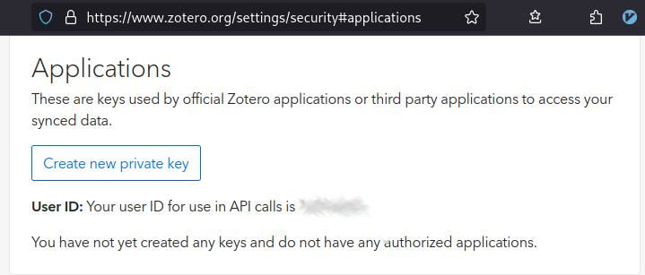

alias:: zotero
tags:: references, literature, zotero

- ## Introduction
- TODO: reference to blog
- On this page, you will find the basic setup to integrate zotero in your logseq workflow.
	- **logseq** is a software designed for knowledge management; it can be used for collecting information about a topic you work on.
	- **zotero** is a reference manager: it is designed for facilitating the management of a digital library, with useful features for literature aggregation, organization, and reference list export.
	- The goal is to connect a zotero collection to logseq, being able to reference zotero entries on logseq pages.
- ## Zotero Prerequisites
- Integration will require a zotero account.
	- Unless you already have one, go to [https://www.zotero.org] and create an account.
	- You will need an *API key*, a cryptographic identifier which will enable logseq to sync with your zotero account. You find that under `zotero.org > [profile] > Settings > Security > Applications`.
	  
	- There, **create a new private key** and store it on your computer.
		- The key should grant read-write access.
		- After creation, a key string will be displayed. **Copy it to a safe place, e.g. a password manager.**
		- Do not share this key with anyone: it grants full power over your zotero library.
	- You should have zotero installed and set up to your liking (conform with INBO standards).
		- TODO could someone please fill in the typical INBO zotero setup? Thank you!
			- betterbibtex
			- link to group library
- ## Logseq Connection